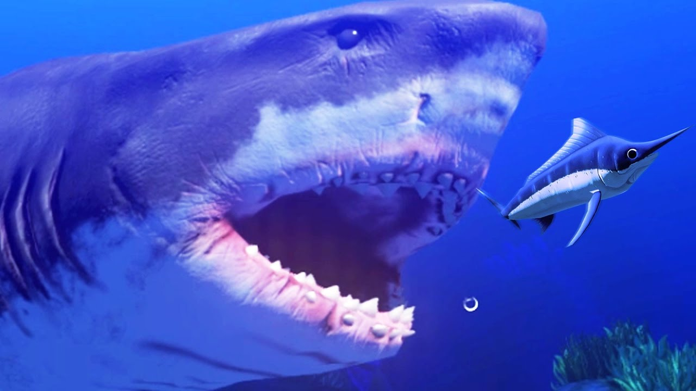

# Wator
Wator is a marine world where 2 types of species, fish and sharks coexist.

The female fish procreate with the male fish.
When a female fish procreates with a male, a new fish is generated that occupies that position, and the parents of this one must look for a position to settle down.

The male fish fight with other male fish and only one can remain.
Female fish fight with other female fish and only one can remain.

Female sharks procreate with male sharks.
When a female shark procreates with a male, a new shark is generated and occupies that position, and its parents must find a position to settle down.

Male sharks fight with other male sharks and only one can remain.
Female sharks fight with other female sharks and one can remain.

Whether a shark falls in the position of a fish or a fish falls into the position of a shark, the shark will eat the fish.

This happens indefinitely in the world of Wator and it is possible to appreciate how the ecosystem changes constantly, but life always prevails.

